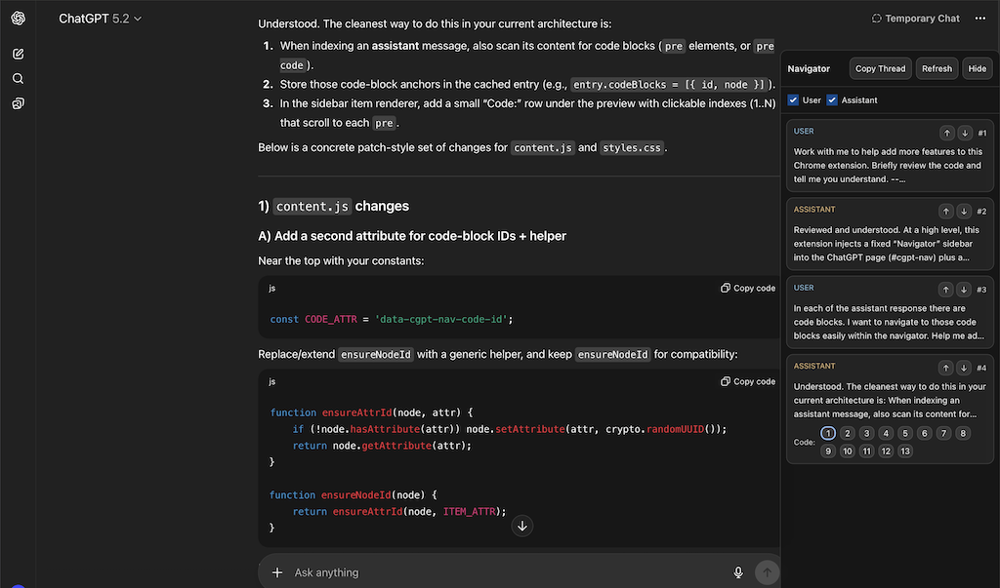

# ChatGPT UX Navigator



A power-user browser extension for ChatGPT that improves navigation and workflow for long conversations. It pairs with a local server to manage prompts and save responses directly to your filesystem.

## Overview

This project consists of two components:

1.  **Browser Extension**: Enhances the ChatGPT interface with a sticky sidebar for navigation and prompt management.
2.  **Local Prompt Server (Bun)**: A lightweight local server that allows you to manage prompts in Markdown files, reuse code snippets via file inclusion, and save ChatGPT responses back to your local disk.

## Features

### Browser Extension

- **Sticky Navigation Sidebar**: Quickly jump between User and Assistant messages.
- **Message Previews**: See the first 3 lines of each message in the sidebar to easily locate context.
- **Code Block Navigation**: Assistant messages with code blocks get direct "jump buttons" in the sidebar (e.g., `Code: 1 2 3`) to scroll immediately to that specific snippet.
- **Prompt Injection**: Select a local prompt file from the sidebar and insert its content into ChatGPT with one click.
- **Save Responses**: Save the last Assistant response directly back to the local prompt file (appending it to the thread).
- **Copy Thread**: One-click copy of the entire visible conversation as structured Markdown (`<|USER|>` / `<|ASSISTANT|>`).
- **Filters**: Toggle visibility of User or Assistant messages in the sidebar.

### Local Prompt Server

- **Markdown-based Prompts**: Write prompts in your favorite local editor.
- **File Inclusion**: dynamically include other local files in your prompt using `@filepath` syntax.
    - Example: `@./src/index.ts` will inject the content of that file into the prompt.
    - Supports recursive inclusion and directory listing.
- **Thread History**: Supports "chat mode" in Markdown files using `# {{USER}}` and `# {{ASSISTANT}}` headers to preserve context.
- **Privacy-First**: Your files stay on your machine. The extension only talks to `localhost`.

## Installation

### 1. Start the Local Server

The server is built with [Bun](https://bun.sh).

```bash
cd server
bun install
bun run index.ts
```

_By default, it serves markdown files from the `server/` directory. You can pass arguments to serve other folders:_

```bash
bun run index.ts <path-to-prompts> <path-to-files-root>
```

### 2. Install the Extension

1.  Open your browser (Chrome, Edge, Brave, or other Chromium-based browsers).
2.  Navigate to `chrome://extensions`.
3.  Enable **Developer mode** (top right).
4.  Click **Load unpacked**.
5.  Select the `extension` folder from this repository.

## Usage

### Managing Prompts

Create a `.md` file in the directory your server is watching.

**Example `my-task.md`:**

```markdown
# {{USER}}

Refactor the following code to be more functional:

@./src/legacy-code.js

# {{ASSISTANT}}

(This section will be auto-filled if you click "Save Response" in the extension)
```

### In ChatGPT

1.  Open ChatGPT.
2.  The **Navigator** sidebar will appear on the right.
3.  Use the dropdown at the top to select `my-task.md`.
4.  Click the prompt text in the sidebar to insert it into the chat input.
5.  After ChatGPT replies, click the **Save** (💾) icon in the sidebar to append the response to `my-task.md`.

## Development

- **Extension**: Vanilla JS/CSS. No build step required. Just reload the extension in `chrome://extensions` after changes.
- **Server**: TypeScript running on Bun.

## License

[MIT](https://opensource.org/licenses/MIT)

Copyright (c) 2025-present, Quang Tran.

